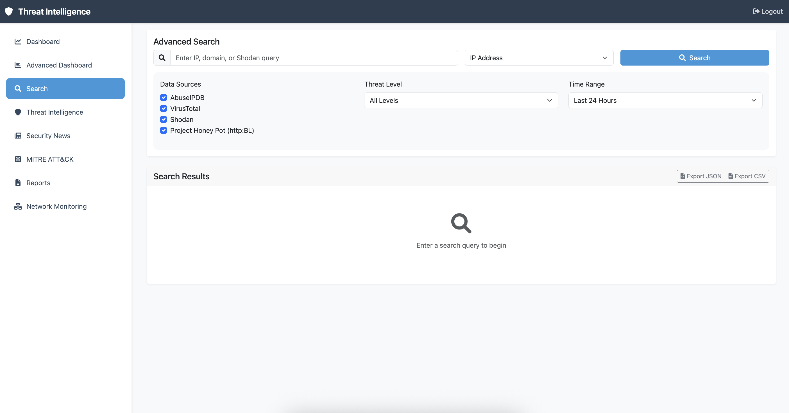

# Threat Intelligence Aggregator with Network Monitoring

A comprehensive security monitoring solution that combines external threat intelligence with real-time local network monitoring. The application provides a unified web dashboard for threat intelligence analysis and local security monitoring.

## Features

### Threat Intelligence
- **Multi-source Integration**: AbuseIPDB, VirusTotal, Shodan, and HttpBL
- **IP Reputation Checking**: Real-time IP reputation analysis
- **Malware Detection**: File hash analysis and malware scanning
- **Network Intelligence**: Port scanning and service detection

### Network Monitoring
- **Real-time Connection Tracking**: Monitor all network connections
- **Process Monitoring**: Track system processes and their network activity
- **YARA-based Malware Detection**: Local malware scanning using YARA rules
- **Threat Correlation**: Automatically correlate local events with external threat intelligence

### Unified Dashboard
- **Interactive Web Interface**: Real-time updates via WebSocket
- **Comprehensive Alerts**: Combined alerts from local and external sources
- **Risk Scoring**: Intelligent threat scoring based on multiple factors
- **Historical Analysis**: Track and analyze security events over time

## Screenshots

### Login

The login page.

### Dashboard

The main dashboard provides an overview of threat intelligence data with interactive charts and statistics.

### Network Monitoring

Real-time network monitoring with threat intelligence correlation.

### Search Interface

The search interface allows you to query multiple threat intelligence sources with advanced filtering options.

### Reports View

The reports view displays historical threat intelligence data with detailed analysis and export capabilities.

## Prerequisites

- Python 3.9 or higher
- API keys for:
  - [AbuseIPDB](https://www.abuseipdb.com/account/api)
  - [VirusTotal](https://www.virustotal.com/join-us)
  - [Shodan](https://account.shodan.io/register)
  - [HttpBL](https://www.projecthoneypot.org/httpbl.php) (optional)

## Installation

1. Clone the repository:
```bash
git clone https://github.com/yourusername/threat_intel_aggregator.git
cd threat_intel_aggregator
```

2. Create and activate a virtual environment:
```bash
python -m venv venv
source venv/bin/activate 
```

3. Install dependencies:
```bash
pip install -r requirements.txt
```

4. Create a `.env` file in the project root with your API keys:
```env
ABUSEIPDB_API_KEY=your_key_here
VIRUSTOTAL_API_KEY=your_key_here
SHODAN_API_KEY=your_key_here
HTTPBL_ACCESS_KEY=your_key_here
FLASK_SECRET_KEY=your_secret_key_here
```

## Usage

### Web Dashboard

1. Start the web server:
```bash
python run.py
```

2. Access the dashboard at `http://localhost:5000`
3. Log in with the default credentials:
   - Username: `admin`
   - Password: `admin123`

### Network Monitoring

1. Navigate to "Network Monitoring" in the sidebar
2. Click "Start Monitoring" to begin real-time network analysis
3. View active connections, processes, and alerts
4. Monitor threat intelligence correlation in real-time

### Testing the Integration

Run the integration test to verify everything is working:
```bash
python test_integration.py
```

## Project Structure

```
threat_intel_aggregator/
├── api_clients/           # Threat intelligence API clients
├── network_monitoring/    # Network monitoring components
│   ├── connection_monitor.py
│   ├── process_monitor.py
│   ├── threat_detector.py
│   ├── yara_scanner.py
│   └── yara_rules/       # YARA malware detection rules
├── integration/           # Integration layer
│   ├── event_correlator.py
│   ├── unified_alerter.py
│   └── network_monitor_manager.py
├── web_dashboard/         # Web application
│   ├── templates/        # HTML templates
│   ├── static/          # Static files (CSS, JS)
│   ├── models.py        # Database models
│   └── routes.py        # Route handlers
├── reports/             # Generated reports
├── run.py              # Web server entry point
├── test_integration.py # Integration test script
└── requirements.txt    # Project dependencies
```

## API Integration

The application integrates with four major threat intelligence APIs:

1. **AbuseIPDB**
   - IP reputation checking
   - Abuse confidence scoring
   - Country and ISP information

2. **VirusTotal**
   - Malware detection
   - Network activity analysis
   - Community reputation

3. **Shodan**
   - Port scanning
   - Service detection
   - Vulnerability assessment

4. **HttpBL**
   - DNS-based blacklist checking
   - Threat scoring
   - Visitor type classification

## Network Monitoring Features

### Real-time Monitoring
- **Connection Tracking**: Monitor all TCP/UDP connections
- **Process Analysis**: Track processes and their network activity
- **YARA Scanning**: Local malware detection using YARA rules
- **Behavioral Analysis**: Detect suspicious process behavior

### Threat Correlation
- **Automatic Enrichment**: Correlate local events with external threat intelligence
- **Risk Scoring**: Calculate comprehensive threat scores
- **Alert Generation**: Generate alerts based on correlation results
- **Cache Management**: Efficient caching of threat intelligence results

### Alert System
- **Unified Alerts**: Combine local and external threat data
- **Severity Levels**: Critical, High, Medium, Low, Info
- **Alert Management**: Acknowledge and resolve alerts
- **Export Functionality**: Export alerts for analysis

## Security Considerations

### Local Monitoring
- **Process-level Tracking**: Monitor all running processes
- **Network Analysis**: Track all network connections
- **File Scanning**: YARA-based malware detection
- **Behavioral Detection**: Identify suspicious patterns

### Data Privacy
- **Local Processing**: Network monitoring runs locally
- **Secure Storage**: Encrypted storage of sensitive data
- **API Rate Limiting**: Respect API rate limits
- **Cache Management**: Automatic cache expiration

## Configuration

### Alert Thresholds
Configure alert sensitivity in the integration components:
- Network connection threat score threshold
- Process risk level thresholds
- YARA match thresholds
- Correlation score thresholds

### Monitoring Settings
- Connection monitoring interval
- Process monitoring frequency
- YARA scan frequency
- Cache TTL settings

## Troubleshooting

### Common Issues

1. **Import Errors**: Ensure all dependencies are installed
2. **API Errors**: Verify API keys are correct and have sufficient quota
3. **Permission Errors**: Network monitoring may require elevated privileges
4. **Performance Issues**: Adjust monitoring intervals and cache settings

### Debug Mode

Enable debug logging by setting the log level:
```python
import logging
logging.basicConfig(level=logging.DEBUG)
```

## Contributing

1. Fork the repository
2. Create a feature branch
3. Commit your changes
4. Push to the branch
5. Create a Pull Request

## License

This project is licensed under the MIT License - see the LICENSE file for details.

## Acknowledgments

- [AbuseIPDB](https://www.abuseipdb.com/) for IP reputation data
- [VirusTotal](https://www.virustotal.com/) for malware intelligence
- [Shodan](https://www.shodan.io/) for network intelligence
- [HttpBL](https://www.projecthoneypot.org/httpbl.php) for DNS blacklist data
- [YARA](https://github.com/VirusTotal/yara) for malware detection rules
- [Flask](https://flask.palletsprojects.com/) for the web framework
- [Rich](https://github.com/Textualize/rich) for CLI formatting
