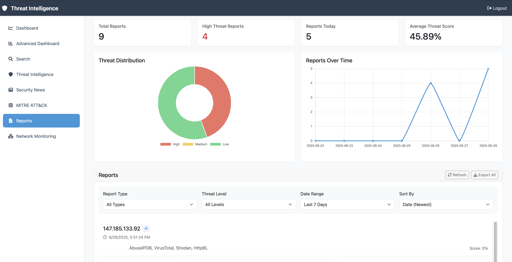

# Threat Intelligence Aggregator

A modern web application that aggregates threat intelligence data from multiple sources including AbuseIPDB, VirusTotal, and Shodan. The application provides both a command-line interface (CLI) and a web dashboard for threat intelligence analysis.

## Features

### Web Dashboard
- Interactive web interface with real-time updates
- Multiple data source integration (AbuseIPDB, VirusTotal, Shodan)
- Rich visualization of threat data
- Report generation and management
- User authentication and session management
- Responsive design for all devices

### Command Line Interface
- Interactive CLI with rich formatting
- Multiple data source integration
- Report generation in JSON format
- Command history and tab completion
- Real-time threat intelligence checks

## Screenshots

### Login

The login page.

### Dashboard

The main dashboard provides an overview of threat intelligence data with interactive charts and statistics.

### Search Interface

The search interface allows you to query multiple threat intelligence sources with advanced filtering options.

### Reports View

The reports view displays historical threat intelligence data with detailed analysis and export capabilities.

## Prerequisites

- Python 3.9 or higher
- API keys for:
  - [AbuseIPDB](https://www.abuseipdb.com/account/api)
  - [VirusTotal](https://www.virustotal.com/gui/join-us)
  - [Shodan](https://account.shodan.io/register)

## Installation

1. Clone the repository:
```bash
git clone https://github.com/yourusername/threat_intel_aggregator.git
cd threat_intel_aggregator
```

2. Create and activate a virtual environment:
```bash
python -m venv venv
source venv/bin/activate  # On Windows: venv\Scripts\activate
```

3. Install dependencies:
```bash
pip install -r requirements.txt
```

4. Create a `.env` file in the project root with your API keys:
```env
ABUSEIPDB_API_KEY=your_key_here
VIRUSTOTAL_API_KEY=your_key_here
SHODAN_API_KEY=your_key_here
FLASK_SECRET_KEY=your_secret_key_here
```

## Usage

### Web Dashboard

1. Start the web server:
```bash
python run.py
```

2. Access the dashboard at `http://localhost:5000`
3. Log in with the default credentials:
   - Username: `admin`
   - Password: `admin123`

### Command Line Interface

1. Run the interactive CLI:
```bash
python interactive_cli.py
```

2. Available commands:
   - `check <ip/domain>` - Check a target using specified APIs
   - `search <query>` - Search using Shodan
   - `help` - Show available commands
   - `clear` - Clear the screen
   - `exit` - Exit the application

## Project Structure

```
threat_intel_aggregator/
├── api_clients/           # API client implementations
├── web_dashboard/         # Web application
│   ├── templates/        # HTML templates
│   ├── static/          # Static files (CSS, JS)
│   ├── models.py        # Database models
│   └── routes.py        # Route handlers
├── reports/             # Generated reports
├── interactive_cli.py   # CLI implementation
├── run.py              # Web server entry point
└── requirements.txt    # Project dependencies
```

## API Integration

The application integrates with three major threat intelligence APIs:

1. **AbuseIPDB**
   - IP reputation checking
   - Abuse confidence scoring
   - Country and ISP information

2. **VirusTotal**
   - Malware detection
   - Network activity analysis
   - Community reputation

3. **Shodan**
   - Port scanning
   - Service detection
   - Vulnerability assessment

## Report Generation

Reports are generated in JSON format and include:
- Target information (IP/domain)
- Timestamp of the check
- Results from each API
- Threat scores and confidence levels
- Additional metadata

Reports are stored in the `reports/` directory and can be accessed through both the web dashboard and CLI.

## Contributing

1. Fork the repository
2. Create a feature branch
3. Commit your changes
4. Push to the branch
5. Create a Pull Request

## License

This project is licensed under the MIT License - see the LICENSE file for details.

## Acknowledgments

- [AbuseIPDB](https://www.abuseipdb.com/) for IP reputation data
- [VirusTotal](https://www.virustotal.com/) for malware intelligence
- [Shodan](https://www.shodan.io/) for network intelligence
- [Flask](https://flask.palletsprojects.com/) for the web framework
- [Rich](https://github.com/Textualize/rich) for CLI formatting
